# GST Law Co-pilot - System Architecture

## Architecture Overview

The GST Law Co-pilot follows a modular, pipeline-based architecture designed for scalability, maintainability, and extensibility. The system processes legal documents through a series of specialized components, each responsible for specific aspects of document analysis and affidavit generation.

## High-Level Architecture Diagram

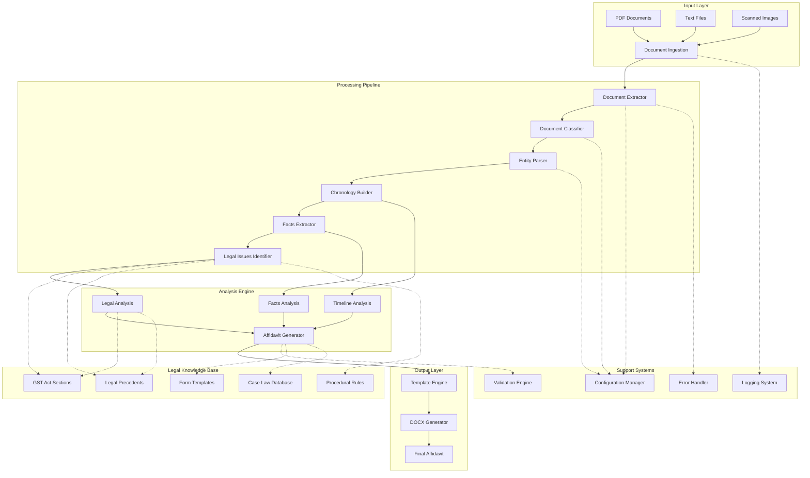

## Component Architecture

### 1. Document Processing Layer

#### Document Extractor
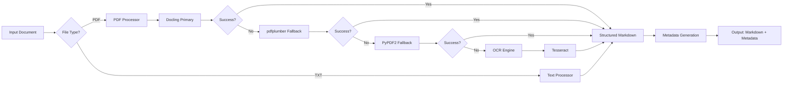

**Key Features**:
- 4-tier extraction strategy with Docling primary
- Structured markdown output with preserved formatting
- OCR fallback for image-based PDFs
- Metadata preservation and extraction method tracking
- Enhanced error handling and logging

#### Document Classifier
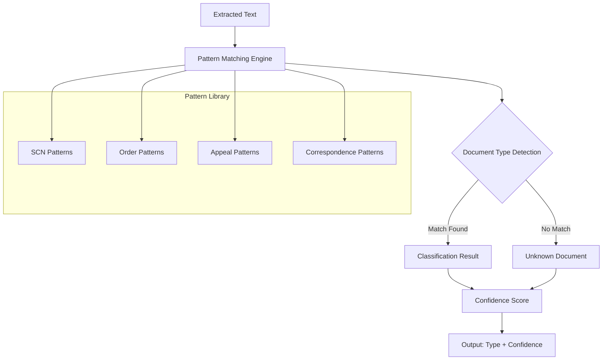

**Classification Categories**:
- Show Cause Notice (SCN)
- Adjudication Order
- Appeal Order
- Tribunal Order
- Correspondence
- Unknown

#### Entity Parser
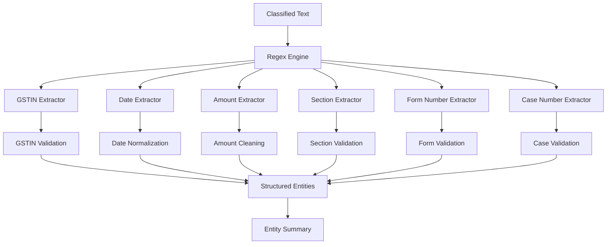

### 2. Analysis Engine

#### Chronology Builder
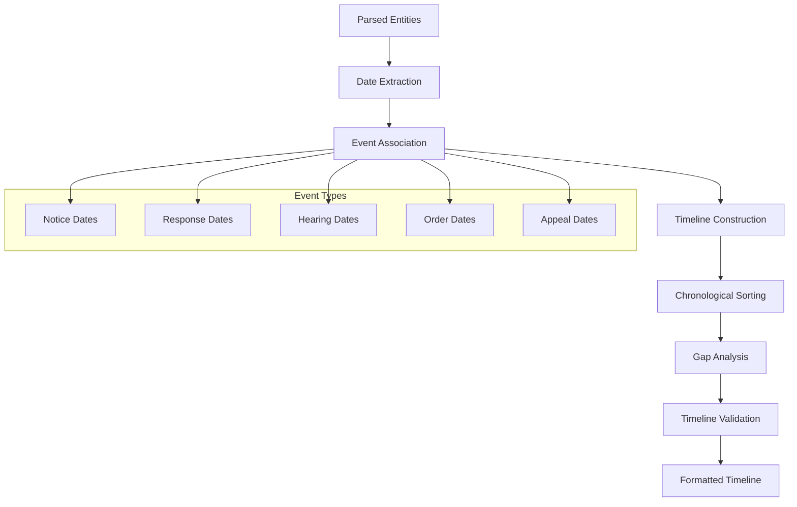

#### Facts Extractor
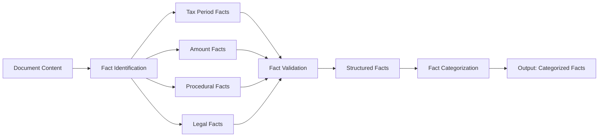

#### Legal Issues Identifier
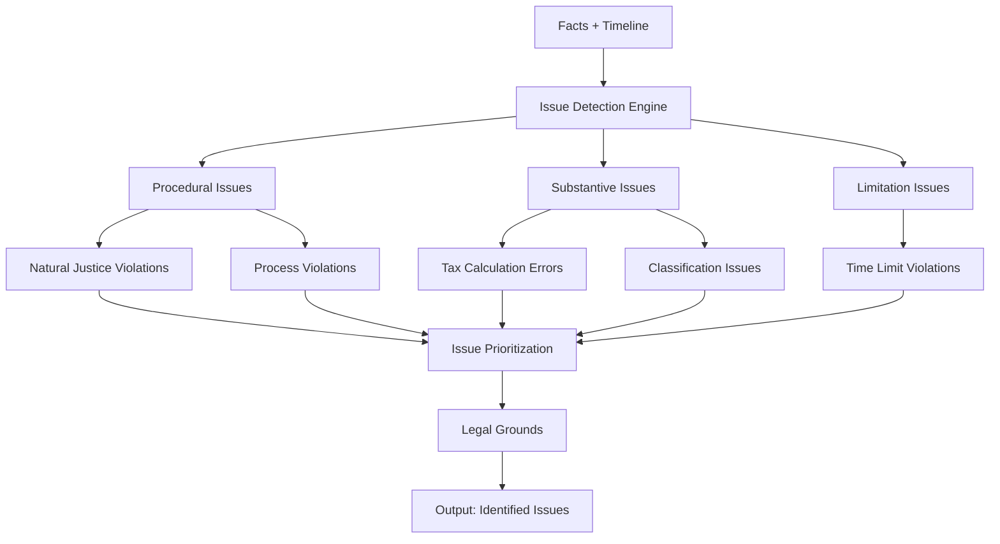

### 3. Legal Knowledge Base

#### Knowledge Base Architecture
```mermaid
graph TB
    A[Legal Knowledge Base] --> B[GST Act Repository]
    A --> C[Procedural Rules Database]
    A --> D[Case Law Database]
    A --> E[Form Templates Repository]
    A --> F[Legal Precedents Database]
    
    B --> G[Section 73 - Tax Determination]
    B --> H[Section 74 - Fraud Cases]
    B --> I[Section 161 - Rectification]
    B --> J[Section 107 - Appeals]
    
    C --> K[Rule 100 - Adjudication]
    C --> L[Rule 142 - Appeal Procedures]
    C --> M[Rule 88 - SCN Requirements]
    
    D --> N[High Court Judgments]
    D --> O[Tribunal Orders]
    D --> P[Supreme Court Cases]
    
    E --> Q[DRC Forms]
    E --> R[Appeal Forms]
    E --> S[Affidavit Templates]
    
    F --> T[Natural Justice Cases]
    F --> U[Limitation Period Cases]
    F --> V[Procedural Violation Cases]
```

#### Legal Knowledge Integration
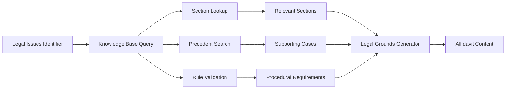

#### Knowledge Base Components
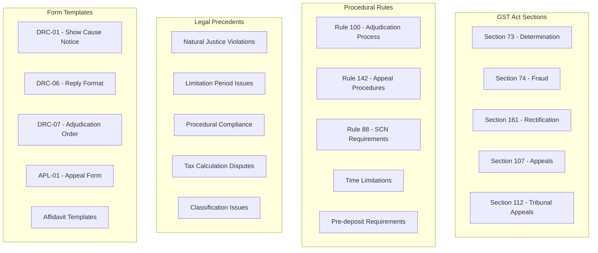

### 4. Generation Engine

#### Affidavit Generator
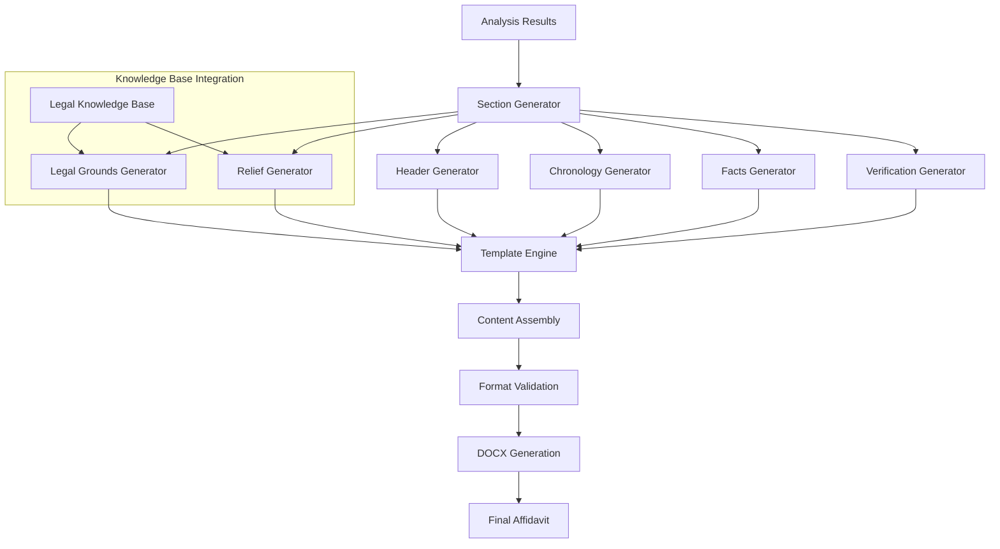

## Data Flow Architecture

### Primary Data Flow
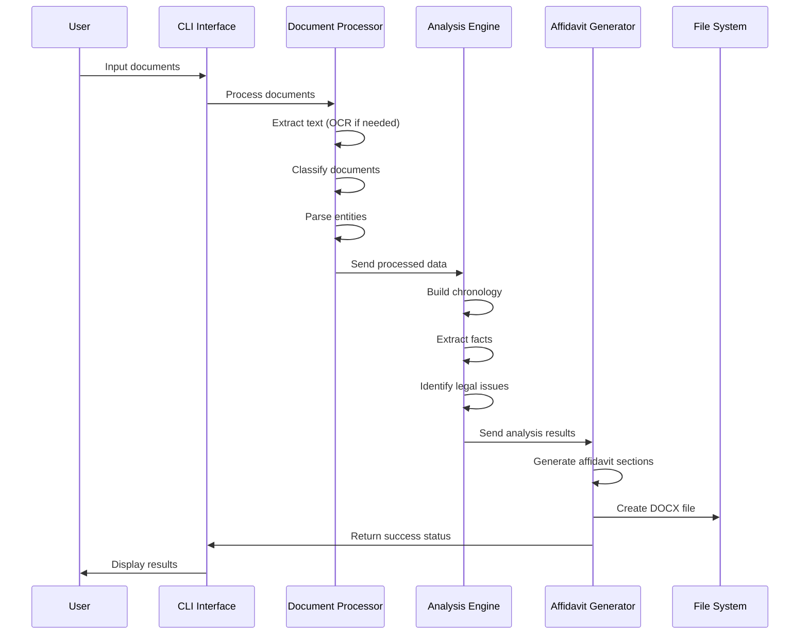

### Error Handling Flow
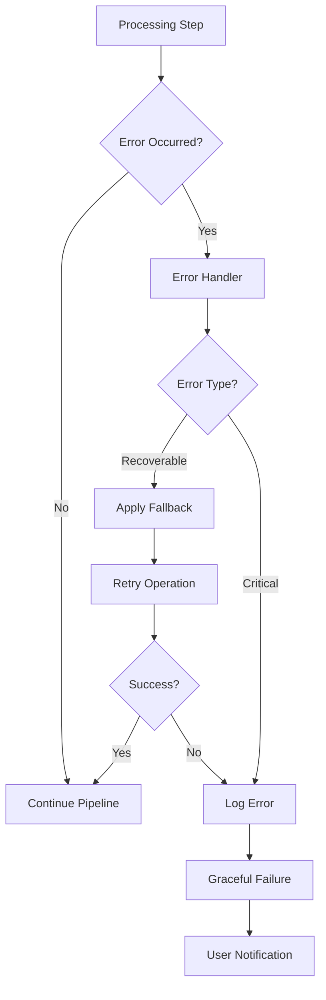

## Technology Stack Architecture

### Core Technologies
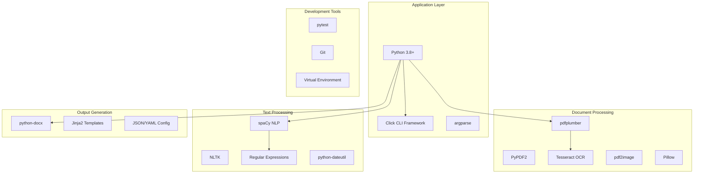

## Module Dependencies

### Dependency Graph
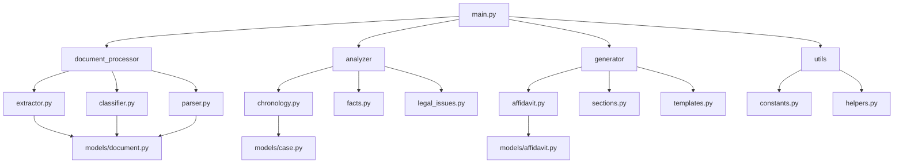

## Configuration Architecture

### Configuration Management
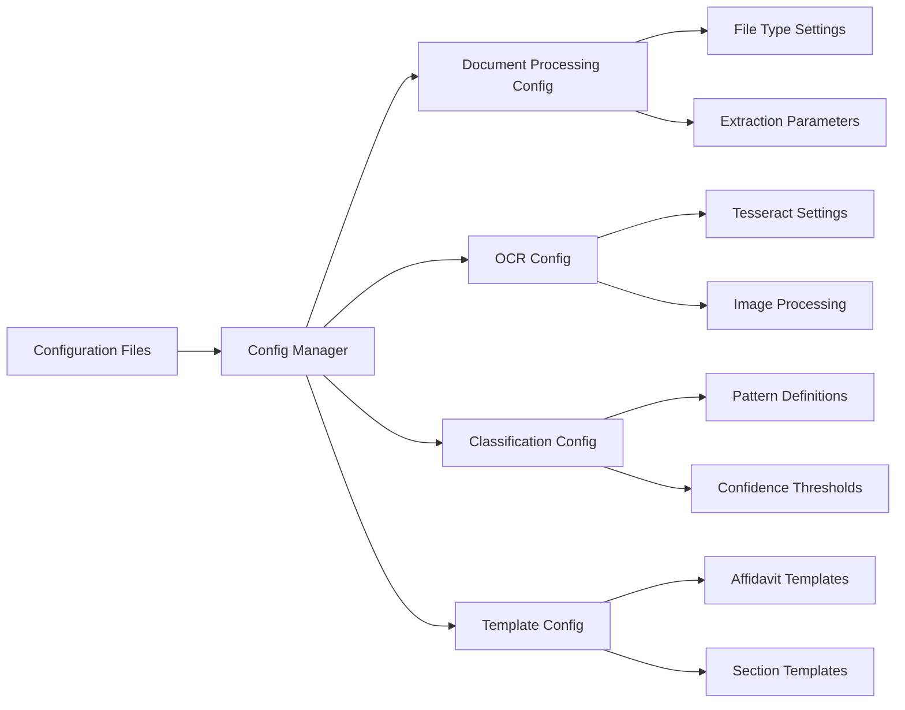

## Security Architecture

### Security Layers
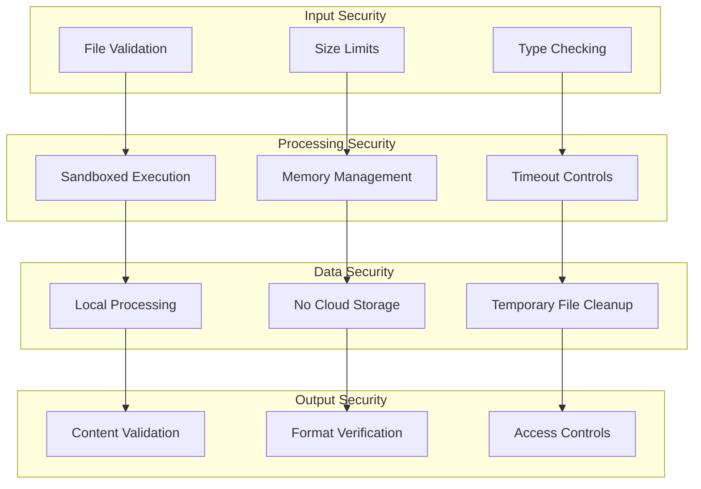

## Performance Architecture

### Performance Optimization
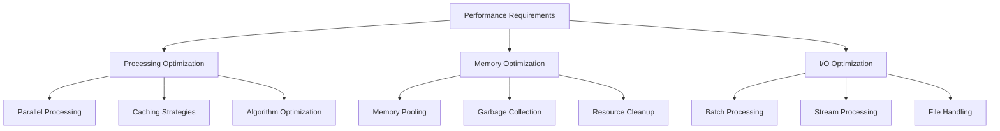

### Scalability Considerations
- **Horizontal Scaling**: Multiple document processing in parallel
- **Vertical Scaling**: Optimized for single-machine performance
- **Resource Management**: Efficient memory and CPU utilization
- **Caching**: Template and configuration caching for performance

## Deployment Architecture

### Local Deployment
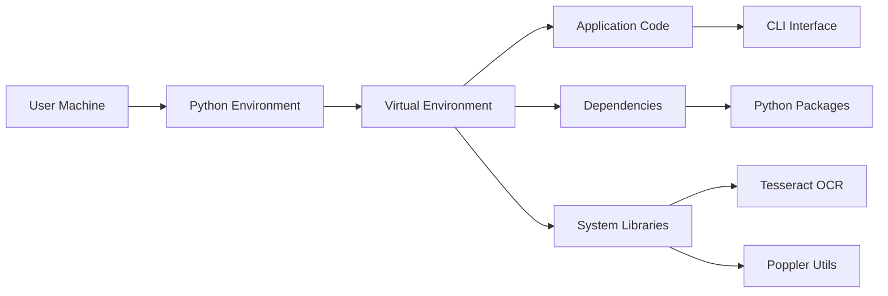

### Installation Flow
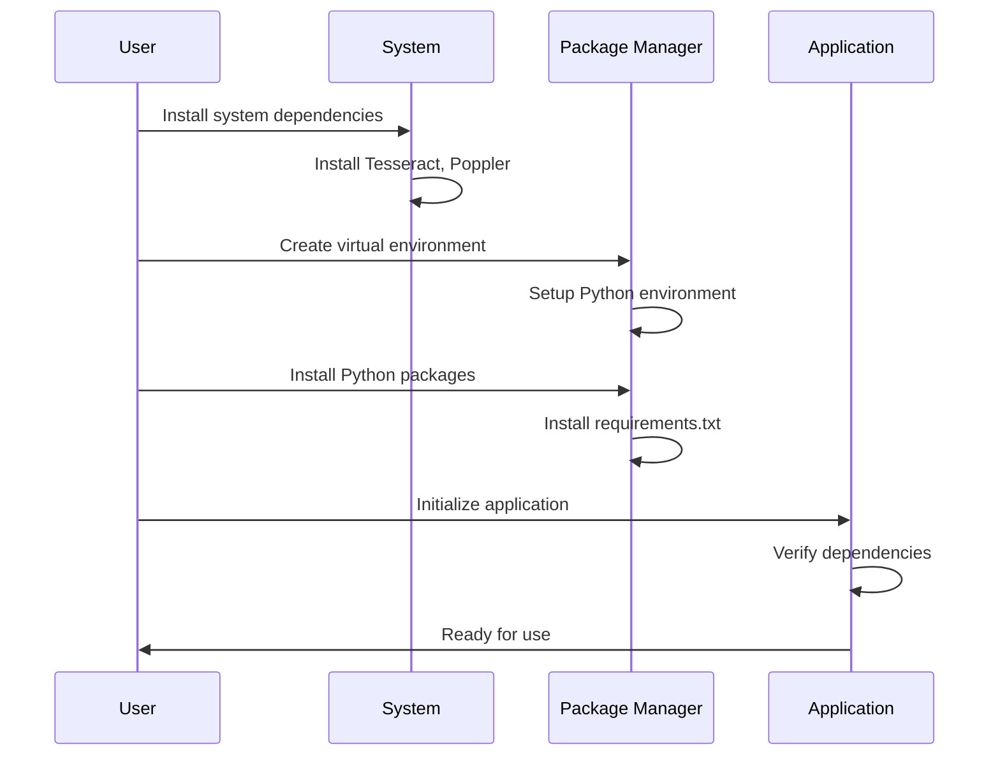

## Monitoring and Logging

### Logging Architecture
```mermaid
graph TD
    A[Application Events] --> B[Logging System]
    B --> C[Debug Logs]
    B --> D[Info Logs]
    B --> E[Warning Logs]
    B --> F[Error Logs]
    
    C --> G[Development]
    D --> H[Production]
    E --> I[Monitoring]
    F --> J[Error Tracking]
    
    G --> K[Console Output]
    H --> L[File Logging]
    I --> M[Alert System]
    J --> N[Error Reports]
```

## Future Architecture Considerations

### Extensibility Points
1. **Plugin Architecture**: Support for custom document processors
2. **Template System**: Customizable affidavit templates
3. **API Layer**: RESTful API for web integration
4. **Database Layer**: Persistent storage for case management
5. **ML Pipeline**: Machine learning model integration

### Migration Path
```mermaid
graph LR
    A[Current CLI] --> B[Enhanced CLI]
    B --> C[Web Interface]
    C --> D[API Service]
    D --> E[Cloud Platform]
    
    A1[Local Processing] --> B1[Hybrid Processing]
    B1 --> C1[Cloud Processing]
    
    A2[File-based] --> B2[Database Integration]
    B2 --> C2[Full Case Management]
```

This architecture provides a solid foundation for the current CLI implementation while maintaining flexibility for future enhancements and scaling requirements.
